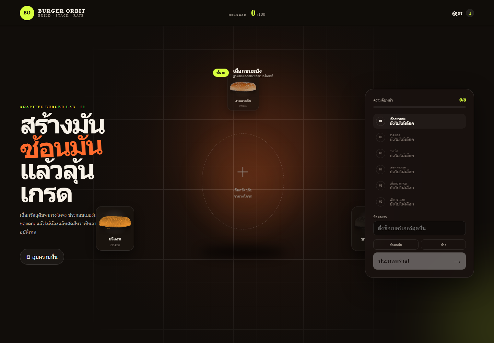

# โปรเจกต์เกมเบอร์เกอร์ — Burger Orbit: Ember Garden

[](https://render.com/deploy?repo=https%3A%2F%2Fgithub.com%2Ftongboonnakem-alt%2Fburger-game-project)

เว็บแอปพลิเคชันแบบ Full-stack สำหรับเลือกวัตถุดิบจากวงโคจร แล้วประกอบเป็นเบอร์เกอร์แบบเรียงชั้นจากบนลงล่าง เมื่อกด **ประกอบร่าง** ระบบจะรวมชั้นอาหารด้วยแอนิเมชัน คำนวณคะแนนเต็ม 100 และจัดอันดับตั้งแต่ `F` ถึง `SS+`

เวอร์ชันปัจจุบันมี **สวนเตาไฟ — Ember Garden**: นำสูตรเบอร์เกอร์ที่ประกอบมาเป็นค่าสถานะของฮีโร่ เดินสำรวจแผนที่ Phaser และต่อสู้แบบ Turn-based ภาพฉาก ตัวละคร และมอนสเตอร์เป็นงานภาพชุดใหม่ในบรรยากาศสวนใต้ดินเรืองแสงเดียวกัน

## สวนเตาไฟ · บทที่ 1

- เดินด้วย **WASD / ลูกศร / ปุ่มบนหน้าจอ** หรือคลิก/แตะทางเดินเพื่อเดินตามเส้นทาง ใช้ **Shift** หรือปุ่มวิ่งเพื่อเพิ่มความเร็ว
- ปราบอัศวินกระเทียมและจอมโจรมันฝรั่ง เพื่อปลดผนึกราชินีมะเขือม่วงด้านบนขวา
- เลือก 4 สาย: **กายภาพ / สายฟ้า / ฮีล / ป้องกัน** เปลี่ยนสายฟรีที่แคมป์ และใช้ปุ่ม **1 โจมตี / 2 สกิลประจำสาย / 3 ป้องกัน / 4 น้ำซุป** หรือแตะปุ่มคำสั่ง
- สกิลใช้พลัง 2 หน่วย; คำสั่งอื่นฟื้นพลัง 1 หน่วย ศัตรูใช้ท่าแรงทุกเทิร์นที่ 3 จึงควรอ่านคำเตือนและป้องกัน
- ฟาร์มมอนสเตอร์ที่เกิดใหม่ทุก 25 วินาที บอสเกิดใหม่ทุก 60 วินาที รับเงิน หินเวทสำหรับตีบวก และผลึกสำหรับอัปสกิลทุกครั้งที่ชนะ
- อุปกรณ์ดรอปพื้นฐาน 40%; เมื่อดรอปจะสุ่มคุณภาพ ธรรมดา 55% / ดีเยี่ยม 27% / แรร์ 13% / อีปิก 4% / ตำนาน 1% ปรับได้ที่ **กระเป๋า → เรตดรอป** และบันทึกเฉพาะเกมในเบราว์เซอร์นี้
- กด **B / กระเป๋า** เพื่อสวมใส่ ขายของ อัปสกิล และลงแต้มพาสซีฟ กลับแคมป์เพื่อซื้ออาวุธ/เกราะและตีบวก คลังจุ 40 ชิ้น; ของดรอปที่เกินความจุจะขายให้อัตโนมัติ
- ตัวละครเลเวลสูงสุด **20** ได้แต้มพาสซีฟ 1 แต้มต่อเลเวลใหม่ พาสซีฟแต่ละสายสูงสุด 5 ขั้นและมีผลร่วมกัน
- สกิลสูงสุด **20** (ไม่เกินเลเวลตัวละคร +4) และอุปกรณ์ตีบวกสูงสุด **+20** สำเร็จ 100% ใช้เงินและหินเพิ่มขึ้นตามขั้น
- กรอบและแสงตามขั้น 5 **ไม้**, 10 **แดง**, 15 **ม่วง**, 20 **ทองพร้อมดาว**; ฮีโร่มีวงแสงและประกายเมื่อเลเวลสูงขึ้น
- เก็บประกายเตาไฟ 5 จุดเพื่อรับ XP หินเวท และน้ำซุป พักที่แคมป์เพื่อเติม HP หรือถอนตัวจากการต่อสู้เพื่อกลับแคมป์
- เพลง `Glorious Morning` เล่นเฉพาะช่วงสำรวจแผนที่ ปรับความดังได้จากแถบ `♫` มุมขวาบน และหยุดอัตโนมัติเมื่อเข้าต่อสู้ ร้านค้า เมนูพัก หรือห้องสร้างเบอร์เกอร์
- เปิดเสียงเอฟเฟกต์แยกจากเพลงด้วยปุ่มเอฟเฟกต์ เมนูพักเกมรองรับ Escape และหยุดเกมเมื่อหน้าต่างเสียโฟกัส
- แผนที่รุ่นใหม่ใช้พื้นที่เดินแบบเปิดบนถนน ลาน และสะพาน ตัวละครวิ่งชิดขอบหรืออ้อมสิ่งกีดขวางได้อิสระ โดยน้ำ หน้าผา พุ่มไม้ เตากลาง และของในแคมป์ยังชนจริง
- มอนสเตอร์ทักผู้เล่นด้วยกล่องคำพูดตอนเริ่มต่อสู้ และปุ่มเอฟเฟกต์จะเปิดเสียงพูดสังเคราะห์ทั่วไปพร้อมเสียงฟาดแบบใหม่
- บันทึกความคืบหน้าอัตโนมัติในเบราว์เซอร์เครื่องนี้ กด **เล่นสวนเตาไฟต่อ** หลังเปิดเว็บใหม่ได้ หากออกระหว่างต่อสู้จะกลับไปยังจุดบันทึกก่อนการต่อสู้นั้น
- เมื่อชนะครบทั้งสามตัว กลับแคมป์แล้วเปิด **รอบสำรวจถัดไป** ได้ถึงรอบ 20 ศัตรูแกร่งขึ้นและให้รางวัลมากขึ้น โดยใช้อุปกรณ์/สกิลที่พัฒนามาต่อเนื่อง เกมมีหนึ่งช่องบันทึก; เริ่มด้วยสูตรใหม่จะใช้ช่องเดียวกัน

งานภาพใหม่และแนวทางสร้างภาพ: [docs/EMBER-ART.md](docs/EMBER-ART.md) รายละเอียดกติกาและสมดุล: [docs/EMBER-GAMEPLAY.md](docs/EMBER-GAMEPLAY.md) ใช้สวนหนึ่งแผนที่ มีระบบฟาร์มมอนสเตอร์และเพิ่มความยาก ไม่ได้มีระบบขุดเหมืองหรือสร้างฐาน



รายงานประกอบงาน: [`output/pdf/Mini-Project-Burger-Orbit-Report.pdf`](output/pdf/Mini-Project-Burger-Orbit-Report.pdf)

## ความสามารถ

- วัตถุดิบภาพเหมือนจริงหมุนรอบเบอร์เกอร์ตรงกลาง
- เลือกวัตถุดิบ 6 หมวด: ขนมปัง ซอส ชีส สัตว์/โปรตีน ของกรุบ และผักผลไม้
- มีวัตถุดิบปกติและวัตถุดิบสายปั่น เช่น ดอจจ์โลฟ ลิงกล้วย ช้างรองเท้าแตะ ชีสหัวคน และผักมีหน้า
- แสดงคะแนนสดระหว่างสร้าง และแอนิเมชันประกอบร่างเมื่อทำเสร็จ
- ประเมินความอร่อย ความสมดุล ความกรอบ ความปั่น แคลอรี และโบนัสคู่เข้ากัน
- เปลี่ยนเบอร์เกอร์ที่สร้างเป็นตัวละครสำหรับโหมดผจญภัย
- เดินสำรวจแผนที่พร้อมแอนิเมชันสี่ทิศ กล้องติดตาม ทางเดินชนขอบ และแผนที่ย่อ
- ต่อสู้แบบ Turn-based กับมอนสเตอร์ 3 ตัว พร้อม HP, XP และสกิลตามค่าวัตถุดิบ
- บันทึกสูตร แสดงรายการ แก้ชื่อ และลบสูตรผ่าน REST API
- กรองข้อมูลด้วย query string เช่น โปรตีน อันดับ และคะแนนขั้นต่ำ
- รองรับจอคอมพิวเตอร์ แท็บเล็ต และโทรศัพท์

## เทคโนโลยี

- Frontend: React, TypeScript, Vite, GSAP, HTML และ CSS
- Backend: Node.js และ Express.js
- การสื่อสาร: REST API และ `fetch()` โดยไม่โหลดหน้าเว็บใหม่

## โครงสร้างโปรเจกต์

```text
Burger-Orbit/
├─ client/                 # ฝั่งหน้าเว็บ
│  ├─ public/ingredients/  # รูปวัตถุดิบพื้นหลังโปร่งใส
│  └─ src/                 # React components, styles และระบบคะแนน
├─ server/
│  └─ app.js               # Express server และ REST API
├─ tests/
│  └─ api-smoke.js         # ทดสอบ endpoint สำคัญ
├─ assets/
│  ├─ raw/                 # ภาพต้นฉบับ
│  └─ SOURCES.md           # แหล่งที่มาของภาพ
└─ package.json
```

## วิธีติดตั้งและรัน

ต้องติดตั้ง Node.js ก่อน จากนั้นเปิด Terminal ในโฟลเดอร์นี้แล้วใช้คำสั่ง:

```bash
npm install
npm run dev
```

เปิดหน้าเว็บที่ `http://localhost:5173` ระหว่างพัฒนา โดย API ทำงานที่ `http://localhost:3001`

หากต้องการรันแบบ production:

```bash
npm run build
npm start
```

จากนั้นเปิด `http://localhost:3001`

## ให้เพื่อนเข้าเล่นผ่านอินเทอร์เน็ต

`localhost` เปิดได้เฉพาะบนเครื่องที่กำลังรันโปรเจกต์ จึงส่งลิงก์ `http://localhost:5173` ให้เพื่อนไม่ได้ โปรเจกต์นี้มีไฟล์ `render.yaml` สำหรับนำทั้งหน้าเว็บและ REST API ขึ้น Render เป็น Web Service เดียว

1. เข้า [Render Dashboard](https://dashboard.render.com/) และเข้าสู่ระบบด้วย GitHub
2. เลือก **New +** แล้วเลือก **Blueprint**
3. เชื่อม repository `tongboonnakem-alt/Mini-Project-660911119`
4. ตรวจสอบว่า Render พบไฟล์ `render.yaml` แล้วกด **Deploy Blueprint**
5. รอจนสถานะเป็น **Live** แล้วคัดลอกลิงก์ที่ลงท้ายด้วย `.onrender.com` ส่งให้เพื่อน

บริการแบบฟรีอาจใช้เวลาสักครู่ในการเปิดครั้งแรกหลังไม่มีผู้ใช้งาน และสูตรที่บันทึกไว้จะเริ่มใหม่เมื่อเซิร์ฟเวอร์รีสตาร์ต เพราะโปรเจกต์เก็บข้อมูลไว้ในหน่วยความจำ

## REST API

Resource หลักคือ `burgers`

| Method | Endpoint | หน้าที่ | สถานะสำเร็จ |
|---|---|---|---|
| GET | `/api/burgers` | อ่านสูตรทั้งหมด | 200 |
| GET | `/api/burgers?protein=beef` | กรองตามโปรตีน | 200 |
| GET | `/api/burgers?rank=A&minScore=80` | กรองอันดับและคะแนนขั้นต่ำ | 200 |
| GET | `/api/burgers/:id` | อ่านสูตรตาม ID | 200 หรือ 404 |
| POST | `/api/burgers` | เพิ่มสูตรและคำนวณคะแนน | 201 หรือ 400 |
| PATCH | `/api/burgers/:id` | แก้ชื่อหรือส่วนผสม | 200, 400 หรือ 404 |
| DELETE | `/api/burgers/:id` | ลบสูตร | 204 หรือ 404 |

ตัวอย่างข้อมูลสำหรับเพิ่มสูตร:

```json
{
  "name": "Classic Burger",
  "layers": ["sesame", "ketchup", "cheddar", "beef", "pickles", "lettuce"]
}
```

ข้อมูลอยู่ในหน่วยความจำของเซิร์ฟเวอร์ จึงเริ่มใหม่เมื่อปิดแล้วเปิดเซิร์ฟเวอร์อีกครั้ง

## การตรวจสอบงาน

```bash
npm run check
npm test
```

`npm run check` ตรวจ TypeScript และ syntax ของเซิร์ฟเวอร์ ส่วน `npm test` ทดสอบ REST API พร้อมระบบเทิร์น พลังสกิล การฟื้นฟู ป้องกัน แพ้/ชนะ การอ่านบันทึก และการเข้าถึงตำแหน่งภารกิจทั้งหมดจากแคมป์

## เกณฑ์คะแนน

คะแนนรวมมาจากค่าพื้นฐานของวัตถุดิบ โบนัสคู่ที่เข้ากัน และค่าปรับเมื่อส่วนผสมปั่นเกินไป อันดับคือ `SS+`, `S`, `A`, `B`, `C`, `D`, `F` โดยสูตรคลาสสิกที่สมดุลจะได้คะแนนสูง ส่วนสูตรทดลองยังเล่นได้แต่จะถูกลดคะแนนตามระดับความปั่น

## แหล่งที่มาของภาพ

รายการ URL และหมายเหตุสิทธิ์ใช้งานอยู่ใน [`assets/SOURCES.md`](assets/SOURCES.md) ภาพถูกตัดพื้นหลังและปรับขนาดสำหรับใช้ในงานการศึกษา
